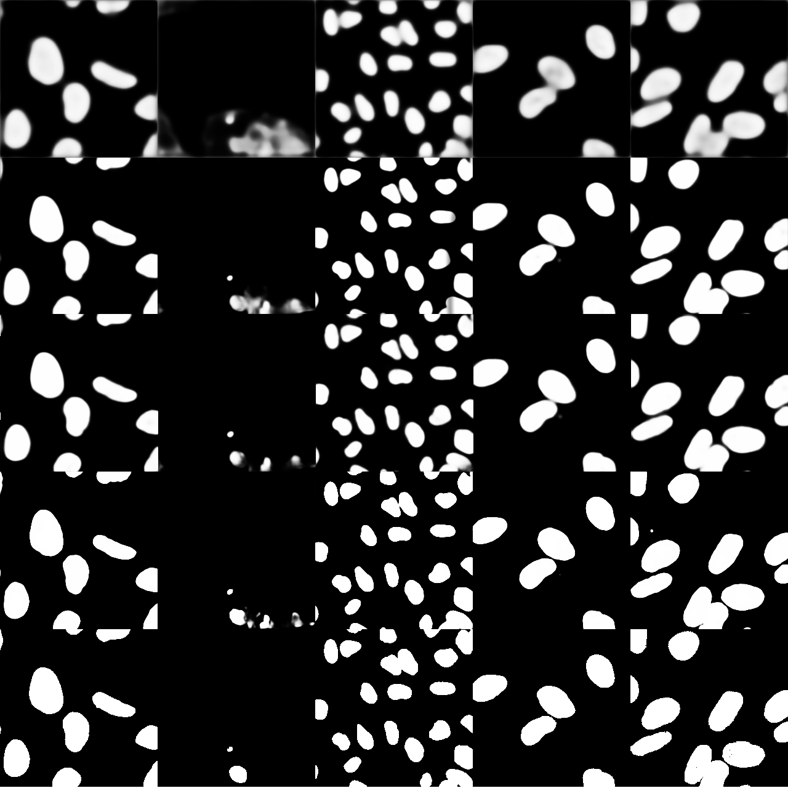
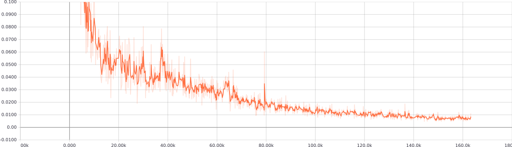

# Processing of Data Science Bowl 2018 kaggle dataset with using U-net neural network

## Overview
Notebook "unet-dsb" and accompanied python files contain implementation of image semantic segmentation using Keras/Tensorflow frameworks and its application to Data Science Bowl 2018 kaggle dataset.

## Dataset
Following dataset is used: [2018 Data Science Bowl](https://www.kaggle.com/c/data-science-bowl-2018) from [kaggle](https://www.kaggle.com). This dataset contains a large number of segmented nuclei images. The images were acquired under a variety of conditions and vary in the cell type, magnification, and imaging modality (brightfield vs. fluorescence). 
### Image sizes
The dataset contains images of different sizes. The smallest image is 256x256 pixels. This size was takes as a basis. Images larger as the basis are tiled to the tiles of 256x256 pixels. The tiles are created in the way  that they always overlap. It is taken in account by the combination of the images in order to get an image of the original size. 

### Image brightness
Dataset contains images of different brightness. Images with high brightness show nuclei as dark spots, images with low brightness show nuclei as bright spots. In order to mitgate the difference, images with mean intensity more than 80 are inverted.

### Training, validation and test sets

## Network architecture
Originaly U-net neural network architecture was proposed here: [U-Net: Convolutional Networks for Biomedical
Image Segmentation](https://arxiv.org/pdf/1505.04597.pdf). Symmetrical architecture used in https://github.com/zhixuhao/unet is used for the training since sizes of input images and output masks are the same. It is achieve by usin of 'same' padding instead of 'valid'.

### Training

Picture below shows evolution of the prediction masks generated during the training on different steps. The last row shows manual annotation

Loss plot

Accuracy plot

Pixel difference plot

