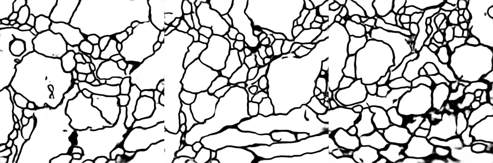
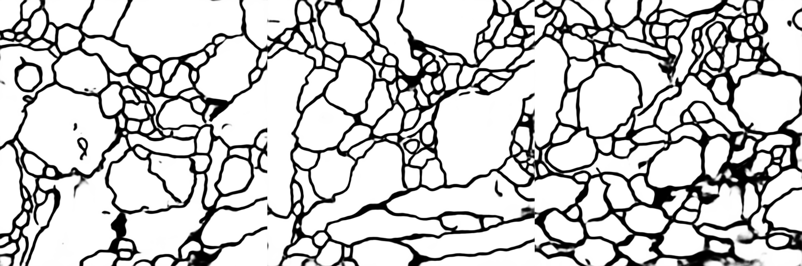

# Processing of ISBI Challenge 2012 dataset with using U-net neural network

## Overview
Notebook "unet-isbi" and accompanied python files contain implementation of image semantic segmentation using Keras/Tensorflow frameworks. 

## Dataset
Following dataset is used: [ISBI Challenge: Segmentation of neuronal structures in EM stacks](http://brainiac2.mit.edu/isbi_challenge/home). The dataset consists from 2 multipage tiff files - one with images, another with labels. The files contain 30 labeled images. The dataset is splitted by 3 parts:
- training set: 24 images. Augmentation is used in order to increase the trainig base.
- validation set: 3 images.
- test set: 3 images.

## Network architecture
Originaly U-net neural network architecture was proposed here: [U-Net: Convolutional Networks for Biomedical
Image Segmentation](https://arxiv.org/pdf/1505.04597.pdf). Symmetrical architecture used in https://github.com/zhixuhao/unet is used for the training since sizes of input images and output masks are the same. It is achieve by usin of 'same' padding instead of 'valid'.


## Implementation
### Metrics
Binary crossentropy is used as a loss function. Accuracy and custom pixelwise comparison metrics were used additionaly. The custom metrics computes a sum of absolute difference of pixel values divided by number of pixels of normalized label and predicte mask multiplied by 100. So the maximum differenxe between 2 images is 100, minimum is 0.

```python

def pixel_difference(y_true, y_pred):
    '''
    Custom metrics for comparison of images
    pixel by pixel. 
    '''
    cof = 100/(input_shape[0]*input_shape[1]*batch_size)
    return cof*K.sum(K.abs(y_true - y_pred))

```

### Callbacks
Following Keras callbacks are used:
- Tensorboard for showing of metrics histories.
- ModelCheckpoint for saving intermediate weights.
- Custom callback for saving of history of predicted images for visualization in the Tensorboard

```python

class ImageHistory(keras.callbacks.Callback):
    
    def __init__(self, tensor_board_dir, data, last_step=0, draw_interval=100):
        self.data = data
        self.last_step = last_step
        self.draw_interval = draw_interval
        self.tensor_board_dir = tensor_board_dir
        
    def on_train_begin(self, logs={}):
        return

    def on_train_end(self, logs={}):
        return

    def on_epoch_begin(self, epoch, logs={}):
        return

    def on_epoch_end(self, epoch, logs={}):
        images = []
        labels = []
        for item in self.data:
            image_data = item[0]
            label_data = item[1]
            y_pred = self.model.predict(image_data)
            images.append(y_pred)
            labels.append(label_data)
        image_data = np.concatenate(images,axis=2)
        label_data = np.concatenate(labels,axis=2)
        data = np.concatenate((image_data,label_data), axis=1)
        self.saveToTensorBoard(data, 'epoch', epoch)
        return

    def on_batch_begin(self, batch, logs={}):
        return

    def on_batch_end(self, batch, logs={}):
        if batch % self.draw_interval == 0:
            images = []
            labels = []
            for item in self.data:
                image_data = item[0]
                label_data = item[1]
                y_pred = self.model.predict(image_data)
                images.append(y_pred)
                labels.append(label_data)
            image_data = np.concatenate(images,axis=2)
            label_data = np.concatenate(labels,axis=2)
            data = np.concatenate((image_data,label_data), axis=1)
            self.last_step += 1
            self.saveToTensorBoard(data, 'batch', self.last_step*self.draw_interval)
        return
    
    def make_image(self, npyfile):
        """
        Convert an numpy representation image to Image protobuf.
        taken and updated from https://github.com/lanpa/tensorboard-pytorch/
        """
        height, width, channel = npyfile.shape
        image = Image.frombytes('L',(width,height), npyfile.tobytes())
        output = io.BytesIO()
        image.save(output, format='PNG')
        image_string = output.getvalue()
        output.close()
        return tf.Summary.Image(height=height, width=width, colorspace=channel,
                             encoded_image_string=image_string)
    
    def saveToTensorBoard(self, npyfile, tag, epoch):
        data = npyfile[0,:,:,:]
        image = (((data - data.min()) * 255) / (data.max() - data.min())).astype(np.uint8)
        image = self.make_image(image)
        summary = tf.Summary(value=[tf.Summary.Value(tag=tag, image=image)])
        writer = tf.summary.FileWriter(self.tensor_board_dir)
        writer.add_summary(summary, epoch)
        writer.close()        
```

## Training
Pictures below show exported metrics plots from the Tensorboard.

### Loss function


### Accuracy


### Pixelwise difference

Pictures bellow as well exported from the Tensorboard and show generated prediction masks for validation set on different iterations. Top rows of the pictures are generated masks, bottom rows are labels.


|  Step  |  Images  |
|--------|----------|
| labels | |
| 200 | |
| 300| |
| 400 | |
| 2100| |
| 3000||

## Results
Picture below shows results achieved after 3 epochs (1000 iterations each). The first row contains original images from the test set, the second - corresponded labels, and the third - generated masks.

